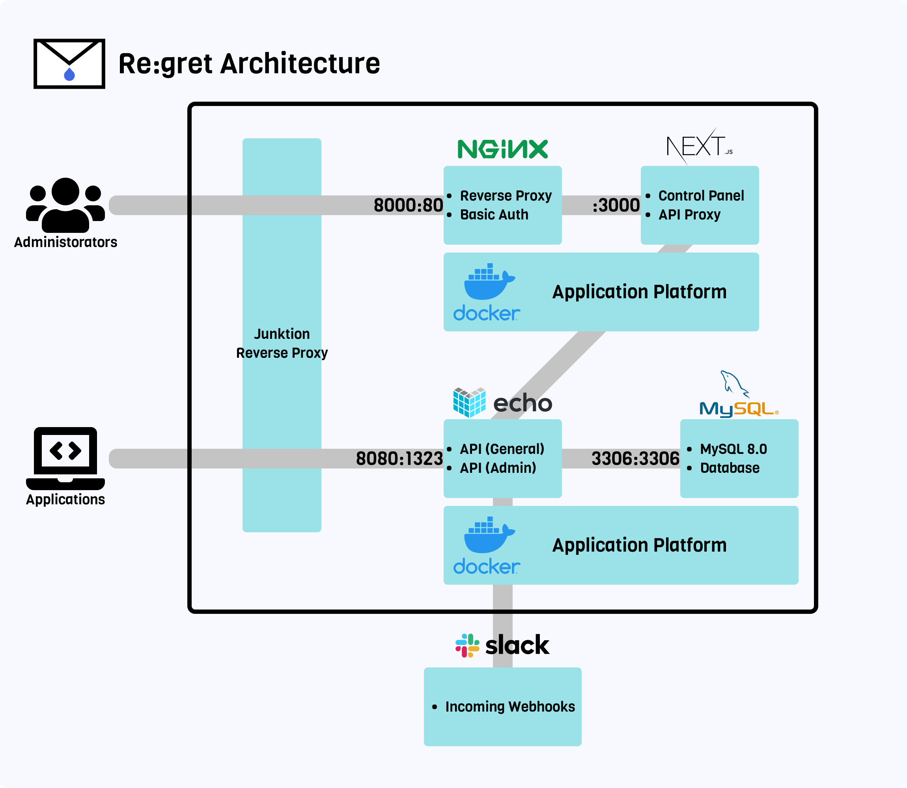

# Re:gret


**IaaS = Inquiry as a Service**

---

## アーキテクチャ



---

## 構築手順

### 開発環境

#### 1. APP_KEYの生成

- 管理用APIのアクセスに必要

```bash
# 実行後、.envに適切な値を設定する
$ cp .env.example .env
$ cd cpanel && cp .env.local.example .env.local
$ make key
```

#### 2. APIの環境構築

- 開発環境にGo 1.16+がインストールされている前提

```bash
# 初回のみ実行
$ make deps
# 開発用サーバとDBの起動
# localhost:1323で立ち上がる
$ make up
# 開発用サーバとDBの終了
$ make down
# DBマイグレーションの実行
$ make migrate/fresh
# シーダーの実行
$ make seed
# 外部公開APIの疎通テスト
$ make test/inquiry
$ make test/category
# app_key_generator.goのクロスコンパイル
$ make key/build
```

- その他のコマンドに関してはMakefileを参照

#### 3. コンパネの環境構築

- コンパネの環境構築は [こちら](./cpanel/README.md) を参照

---

### 本番環境

#### 1. APP_KEYの生成

- 管理用APIのアクセスに必要

```bash
# 実行後、.envに適切な値を設定する
$ cp .env.example .env
# 実行後、.env.localに適切な値を設定する
$ cd cpanel && cp .env.local.example .env.local
$ make key -f Makefile.prod
```

#### 2. APIの環境構築

- 通常はGithub Actions経由で操作を行う
- 基本的に初回構築時のみ、サーバ内で操作する

```bash
# サーバとDBの起動
$ make up -f Makefile.prod
# サーバとDBの終了
$ make down -f Makefile.prod
# DBマイグレーション
$ make migrate/up -f Makefile.prod
```

- その他のコマンドに関してはMakefileを参照

#### 3. コンパネの環境構築

- コンパネの環境構築は [こちら](./cpanel/README.md) を参照
